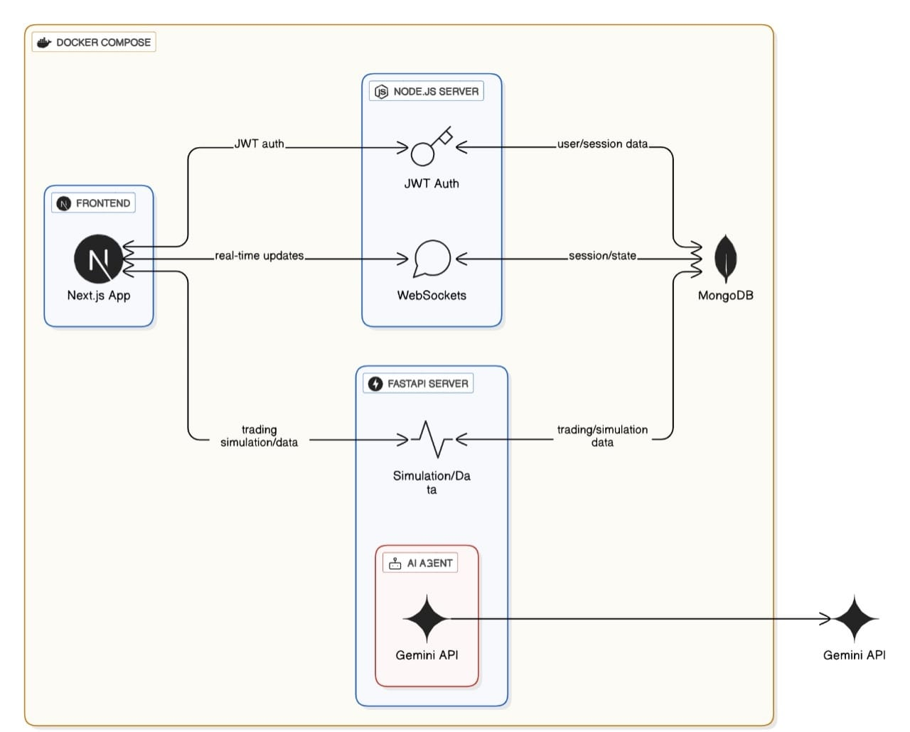

# 📈 Finsight

A multi-agent simulation platform using Large Language Models (LLMs) to explore market behavior, test investment strategies, and understand the impact of external factors on financial markets.

---

## 📋 Table of Contents

- [🚀 Project Overview](#project-overview)
- [✨ Key Features](#key-features)
- [🏗️ Architecture](#architecture)
- [🏁 Getting Started](#getting-started)
- [⚙️ Usage](#usage)
- [🤝 Contributors](#contributors)

---

## Project Overview

**Finsight** aims to build a sophisticated multi-agent system that mimics the actions and behaviors of investors in a virtual stock market. By leveraging Large Language Models, we can create AI agents with diverse profiles and strategies that react to real-world news, policy changes, and market events.

The core goal is to uncover emergent patterns in trading behavior and evaluate how various factors influence market outcomes in a controlled environment, free from the data leakage issues that plague traditional backtesting. This platform serves as a powerful research tool for developing smarter investment strategies and enhancing financial decision-making tools.

---

## Key Features

- **Multi-Agent Simulation:** A robust framework that supports diverse investor profiles (e.g., conservative, aggressive) and complex trading strategies.
- **Dynamic Event Integration:** Incorporates external factors like macroeconomic indicators, policy changes, and global events to influence agent decisions.
- **Leakage-Free Environment:** A carefully designed system that prevents agents from accessing future data, ensuring the integrity of simulations.
- **Visualization Dashboard:** An interactive dashboard to monitor trading behaviors, stock price fluctuations, and key agent performance metrics in real-time.
- **Behavioral Analysis:** Advanced modules to identify patterns and correlations between external events and trading outcomes.
- **LLM Evaluation:** A flexible architecture for evaluating and comparing the performance of different LLM-based agent configurations.

---

## Architecture

### Tech Stack

- **Backend Services:** Python (FastAPI), Node.js
- **Frontend:** Next.js
- **Database:** MongoDB
- **LLM API:** Google Gemini API
- **Containerization:** Docker, Docker Compose

### Diagram

_Once you create your diagram and place it in an `assets` folder, you can use the line below to display it._

---

## Getting Started

_(Instructions on how to install and run the project locally will be added here soon.)_

---

## Usage

_(Instructions on how to use the platform and run simulations will be added here soon.)_

---

## Contributors

Team Members Involved in This Project

- [Manoj Reddy](https://github.com/Manojreddykamasani)
- [Sai Ganesh](https://github.com/VenkataSaiGaneshChavidi)
- [Sreenidhi Reddy](https://github.com/Sreenidhi09)
- [Divija Reddy](https://github.com/divijareddy15)
- [Vaishnavi Reddy](https://github.com/vaishnavireddy-776)
- [Mahindra Reddy](https://github.com/Mahindra191)
