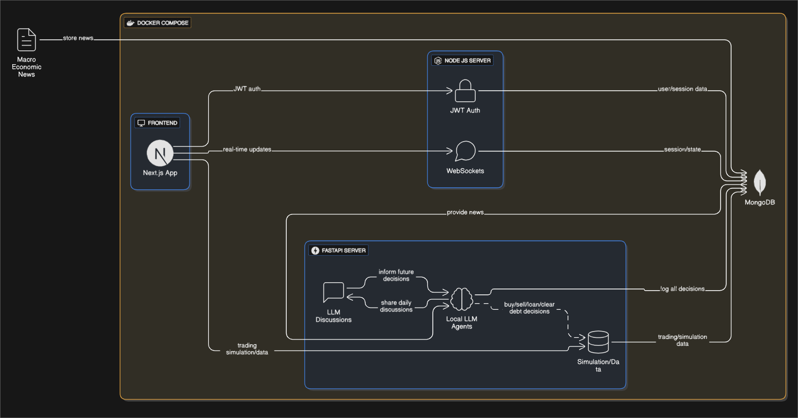

# 📈 Finsight

A multi-agent simulation platform using Large Language Models (LLMs) to explore market behavior, test investment strategies, and understand the impact of external factors on financial markets.

---

## 📋 Table of Contents

- [Project Overview](#project-overview)
- [Key Features](#key-features)
- [Architecture](#architecture)
- [Getting Started](#getting-started)
- [Usage](#usage)
- [Contributors](#contributors)

---

## Project Overview

**Finsight** is a sophisticated multi-agent system that mimics the actions and behaviors of investors in a virtual stock market. By running local Large Language Models, we create AI agents with diverse profiles and strategies that react to real-world news, policy changes, and market events.

The core goal is to uncover emergent patterns in trading behavior and evaluate how various factors influence market outcomes in a controlled environment. This platform serves as a powerful research tool for developing smarter investment strategies and enhancing financial decision-making tools.

---

## Key Features

- **Local LLM Agent Simulation:** A robust framework supporting diverse investor profiles driven by locally-run LLMs for full control and privacy.
- **Inter-Agent Communication:** Agents engage in daily discussions, influencing each other's future trading decisions and strategies.
- **Dynamic News Integration:** A dedicated service fetches and stores external macroeconomic news, which is then provided to the simulation engine to impact market conditions.
- **Real-Time Visualization Dashboard:** An interactive dashboard to monitor trading behaviors, stock price fluctuations, and key agent performance metrics in real-time via WebSockets.
- **Secure Authentication:** User access to the dashboard is managed through a JWT-based authentication system.

---

## Architecture

### Tech Stack

- **Backend Services:** Python (FastAPI), Node.js
- **Frontend:** Next.js
- **Database:** MongoDB
- **LLM:** Local LLMs
- **Containerization:** Docker, Docker Compose

### Architectural Flow

The system operates with a dual-backend architecture. An external service feeds macroeconomic news into a central **MongoDB** database. The **Node.js server** handles user authentication (JWT) and retrieves this news, providing it to the simulation engine while also managing real-time data pushes to the frontend via **WebSockets**.

The **FastAPI server** runs the core market simulation, where **Local LLM Agents** make trading decisions and engage in daily discussions that inform future actions. All agent decisions and simulation data are logged to MongoDB. Finally, the **Next.js** frontend provides a comprehensive dashboard, receiving live updates from the WebSocket server and historical data from the FastAPI server.

### Diagram

---

## Getting Started

---

## Usage

---

## Contributors

Team Members Involved in This Project

- [Manoj Reddy](https://github.com/Manojreddykamasani)
- [Sai Ganesh](https://github.com/VenkataSaiGaneshChavidi)
- [Sreenidhi Reddy](https://github.com/Sreenidhi09)
- [Divija Reddy](https://github.com/divijareddy15)
- [Vaishnavi Reddy](https://github.com/vaishnavireddy-776)
- [Mahindra Reddy](https://github.com/Mahindra191)
